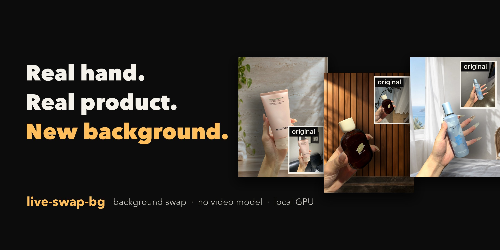
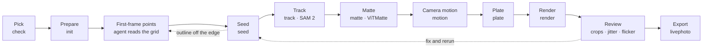

<div align="center">



# live-swap-bg

**Keep the hand and the product exactly as shot, put a new scene behind them, and let it move with the original camera.**

[](skills/live-swap-bg/SKILL.md)
[](skills/live-swap-bg/SKILL.md)
[](pyproject.toml)
[](#license)
[](#specs)
[](#faq)
[](LICENSE)

[Examples](#examples) · [Why](#why) · [Pipeline](#pipeline) · [Backgrounds](#generating-the-background) · [Install](#install) · [Usage](#usage) · [Layout](#repository-layout) · [FAQ](#faq) · [中文](README.md)

</div>

---

Take a hand-held product clip, an iPhone Live Photo or a short video, and put it in front of **a scene you generate**:
the hand, the nails and the text on the packaging are the original pixels, the background pans with the original
camera, and the product is relit to the new scene's light and casts a shadow. Exports **MP4**, and **Live Photo** too.

No video generation model is involved; the whole pipeline runs on your local GPU (SAM 2 tracking + ViTMatte edges).
It comes out of our own work making Live Photo posts that sell products on Douyin (the Chinese TikTok). We have made
several hundred of them, and the skill is written from the mistakes we hit.

## Examples

All three use the same commands; only the first-frame prompt points, the background image and a flag or two differ
(noted under each). Original on the left, new background on the right.

### Example 01 · Cleanser tube (travertine wall, leaf shadows)

The phone sways sideways by more than 100 pixels, and the new background pans with the original camera. The small gap
between the thumb and the tube is filled solid with `render --max-gap-pixels`, so it no longer flickers between the old
wall and the new one.


### Example 02 · Dark glass bottle (wood slat wall, warm light)

The original background is a sheer curtain and a house plant; it becomes a warm wood wall. The source drops a frame
around frame 50, so only the first 49 frames are rendered (`render --count 49`). The new scene is a good deal darker
than the old wall, so `plate --no-match` blurs it without colour matching.


### Example 03 · Spray bottle + long clear nails (seaside bedroom)

Long clear nails are the hardest kind to matte: what shows through them is the wall behind. The old wall is dark grey
and the new scene is bright, so this one uses `--no-match` as well.


A still overview of all three: [`demo/gallery/before-after.jpg`](demo/gallery/before-after.jpg).

## Why

- 🎬 **No video generation model.** The hand and the product are real footage. The tool only segments and mattes,
  so the product never warps and the text on its packaging never gets rewritten. AI video models work out the product
  from a single image and often get the packaging wrong, and then the product in the video no longer matches what the
  buyer receives. Only the background uses an image model, and only for one still image.
- 💻 **Local GPU, close to zero marginal cost.** On an Apple M4 Mac, a 2.8-second Live Photo (83 frames) takes 5 to 7
  minutes end to end and costs nothing beyond electricity. For comparison, a pay-per-clip video generation service we
  used before charged about ¥2 (roughly US$0.30) for one 4-second 720p clip.
- 📷 **Looks like it was shot there.** The new background pans with the camera motion measured from the original
  background (a moving product in front of a dead-still background gives itself away at once). The product is relit
  to the new scene's light and casts a shadow, and the old wall colour carried on the matte edge is cleaned off.

## Pipeline



| Step | Command | What it does |
|---|---|---|
| 🎯 **Pick** | `check` | whether the original background gives usable camera motion; a bad clip cannot be fixed later |
| 📐 **Prepare** | `init` | centre-crop to 3:4, 720×960, 30 fps; write the first frame with a coordinate grid |
| 📍 **Seed** | `seed` | first-frame mask from the boxes and points in `prompts.json`, plus an outline image to check |
| 🎞️ **Track** | `track` | SAM 2 carries the mask through every frame; `--multi` tracks each group as its own object |
| ✂️ **Matte** | `matte` | ViTMatte soft edges; `--thin` keeps thin parts such as pump nozzles and brush tips |
| 🧹 **Stabilize** | `stabilize` | optional: mask vote, alpha dropout fill, alpha median; each has side effects, see the skill |
| 🧭 **Motion** | `motion` | camera translation from the original background; falls back to a still background when unreliable |
| 🖼️ **Plate** | `plate` | portrait-mode blur, edge ring matched to the old wall colour; refuses a large brightness gap, then `--no-match` only blurs |
| 💡 **Render** | `render` | edge repair, relighting, cast shadow; composite and encode the MP4 |
| 🔍 **Review** | `crops` `jitter` `flicker` | full-resolution edge crops, background shake, single-frame flicker scan |
| 📱 **Export** | `livephoto` | Live Photo image + video, with device model, time and location metadata stripped |

Every step prints a JSON summary and writes its results into the working directory; the layout is described at the
top of [`live_swap_bg/clip.py`](live_swap_bg/clip.py).

### Principles

> Only original pixels for the hand and product · no video generation model · the background follows the original camera · matte only the one product in hand · metrics point, a person decides

## Specs

| | |
|---|---|
| Output | portrait 3:4, 720×960, 30 fps; the input is centre-cropped, never stretched |
| Input | a hand-held product clip of up to 150 frames (5 seconds at 30 fps); cut longer ones with `init --start/--end` |
| Camera | translation only: no rotation, zoom, perspective or parallax; hand-held shake is fine, big camera swings are not |
| Clip choice | the original background needs texture (a plain wall gives no motion); the hand enters from an edge; nothing touches the top edge |
| Speed | 5 to 7 minutes for a 2.8-second clip (83 frames) on an Apple M4 (4.6 and 6.8 minutes in two runs, depending on load) |
| Hardware | tested on Apple Silicon Macs (MPS); NVIDIA GPUs (CUDA) are supported in code but untested |
| Export | MP4; Live Photo is macOS only and needs the original iPhone Live Photo `.MOV` as input |
| People | the first-frame points are the agent's job, nobody clicks anything; a person must watch every result, and our own full-size reviews flag about 8 clips in 20 |

## Generating the background

The new background is a single still image made with an image model. We use the image tool built into the
[Codex CLI](https://github.com/openai/codex) (signed in with a ChatGPT account), with the model set to
`gpt-5.6-terra`: about a minute per image, 1086×1448 output. All four backgrounds in this repo's demos were made
this way:

```bash
codex exec -m gpt-5.6-terra --sandbox read-only --skip-git-repo-check \
  "Generate one image. Do not write code, do not explain. $(cat demo/eucerin/background-prompt.txt)"
# the image lands under ~/.codex/generated_images/
```

We have not tried other image models; any of them should work if the prompt follows these rules:

- **Background only**: no people, hands, products, text or logos. Unless told not to, models often draw the product in.
- **Portrait 3:4**, with the centre left open and props only in the corners, away from where the hand and product move.
- **About as bright as the original wall**: when the gap is too large, `plate` refuses to colour-match (see
  [Pipeline](#pipeline)). Keep the product and the background apart in tone: no white bottle against a pure white wall.
- **A scene that fits the product**: a bathroom counter for a cleanser, a bedroom window for a fragrance, and no
  repeats within a batch.

Example prompts: [`demo/eucerin/background-prompt.txt`](demo/eucerin/background-prompt.txt), and the ones behind the
three examples above in [`demo/gallery/scene-prompts/`](demo/gallery/scene-prompts/).

## Install

**Needs** Python 3.10+ and [ffmpeg](https://ffmpeg.org/); Live Photo export also needs the Xcode command line tools
(`xcode-select --install`).

```bash
git clone https://github.com/Gxz-NGU/live-swap-bg.git
cd live-swap-bg
python3 -m venv .venv && source .venv/bin/activate
pip install -e .
live-swap-bg download-models        # SAM 2.1 Large + ViTMatte, about 1.3 GB, into ./models
```

Then give the skill to your agent:

**Claude Code**

```bash
cp -r skills/live-swap-bg ~/.claude/skills/
```

**Codex**

```bash
cp -r skills/live-swap-bg ~/.codex/skills/
```

Start a new conversation afterwards. The agent needs to find the `live-swap-bg` command and the models: launch it from
a terminal with `.venv` activated, and outside the repo set `LIVE_SWAP_BG_MODELS=<repo path>/models` (the default is
`./models` in the current directory).

## Usage

In Claude Code or Codex, just say:

> Use live-swap-bg to swap the background of ~/Desktop/IMG_2034.MOV. The product is a pink cleanser tube; I want a bright bathroom counter. Show me the before/after and the edge close-ups when you're done.

The agent follows the skill end to end: checks the clip → writes the first-frame points from the grid and fixes them
from the outline → tracks and mattes → writes a background prompt and generates it → renders → reviews the edges and
background shake, then hands you the result. This is how we use it day to day: a person supplies the footage and
watches the finished clip. The skill is a plain Markdown guide (written in Chinese) and is not tied to Claude Code:
our production batches have also been run by Codex from the same instructions.

To run it yourself on the bundled demo:

```bash
live-swap-bg init demo/eucerin/IMG_1848.MOV work/eucerin
cp demo/eucerin/prompts.json work/eucerin/      # first-frame prompt points; for your own clip, have an agent write them, or write them by hand
live-swap-bg seed  work/eucerin                 # check work/eucerin/seed-review.jpg: the outline should sit on the real edges
live-swap-bg track work/eucerin                 # SAM 2 tracks the whole clip (3 to 4 minutes on an M4)
live-swap-bg matte work/eucerin                 # ViTMatte refines the edges (1.5 to 2 minutes on an M4)
live-swap-bg motion work/eucerin                # camera motion from the original background
live-swap-bg plate work/eucerin demo/eucerin/background.png
live-swap-bg render work/eucerin                # -> work/eucerin/out/eucerin.mp4
live-swap-bg crops work/eucerin                 # full-resolution edge crops for review
live-swap-bg livephoto work/eucerin             # -> work/eucerin/out/livephoto/eucerin.JPG + .MOV
```

## Repository layout

```
live-swap-bg/
├── live_swap_bg/            the live-swap-bg command line tool
│   ├── cli.py               entry point for every subcommand
│   ├── clip.py              working directory layout
│   ├── prepare.py           init: crop, extract frames, gridded first frame
│   ├── seed.py              seed: first-frame mask and outline from prompt points
│   ├── track.py             track: SAM 2 through the whole clip
│   ├── matte.py             matte: ViTMatte soft edges
│   ├── stabilize.py         stabilize: temporal clean-up
│   ├── motion.py            motion: camera translation from the old background
│   ├── plate.py             plate: blur the scene, match the edge ring to the old wall
│   ├── render.py            render: composite and encode
│   ├── edges.py  light.py   edge repair; relighting and cast shadow
│   ├── livephoto.py         livephoto, via swift/LivePhotoPair.swift
│   ├── qa.py                check / crops / jitter / flicker
│   └── models.py  device.py download-models; GPU selection
├── skills/live-swap-bg/
│   └── SKILL.md             the agent's guide: placing points, what to check at each step, common problems
├── demo/
│   ├── eucerin/             quick start demo (shot by the author): clip, prompt points, background and its prompt
│   └── gallery/             the three examples' GIFs, a still overview, scene prompts
├── assets/                  README banners
├── tests/                   unit tests (synthetic data, no GPU or models needed)
├── README.md  README.en.md
├── pyproject.toml
└── LICENSE
```

The three examples' source clips are not in the repo, only the comparison GIFs and scene prompts. To run the tests:
`pip install -e ".[dev]" && pytest -q`.

## FAQ

<details>
<summary><b>Does it work without a Mac?</b></summary>

NVIDIA GPUs (CUDA) are supported in the code, but we have not tested them. Without a GPU you can pass `--device cpu`;
it will be very slow, and it is untested too. Live Photo export uses AVFoundation and is macOS only.
</details>

<details>
<summary><b>Does relighting change the product's colour?</b></summary>

Barely. Relighting only changes brightness and the lit/shaded sides; the warm/cool shift is hard-capped at ΔE 2, below
the just-noticeable difference (see [`live_swap_bg/light.py`](live_swap_bg/light.py)). The text and graphics on the
packaging are the original pixels.
</details>

<details>
<summary><b>The new background shakes. What now?</b></summary>

Run `live-swap-bg jitter`; a `high_frequency_std_px` above 0.5 means the background shakes. When the old wall has
too little texture, the camera estimate follows noise; use `motion --static` to keep the background still. If the
phone itself was shaking, the background should shake with it.
</details>

<details>
<summary><b>There is a white or dark rim around the edges.</b></summary>

`render` cleans the old wall colour off the matte edge by default. If some is left, look at `out/edge-crops.jpg`;
the usual causes and fixes are in the [problem table in the skill](skills/live-swap-bg/SKILL.md).
</details>

<details>
<summary><b>Why must a person watch every result?</b></summary>

Some problems no metric catches, such as a gap between fingers that flips between the old wall and the new one from
one frame to the next, or whether long clear nails look right. In our own full-size reviews, about 8 clips in 20 turn
up a problem.
</details>

<details>
<summary><b>The phone does not recognise the exported Live Photo.</b></summary>

The input must be the original iPhone Live Photo `.MOV`: its metadata track is what Photos uses to recognise a Live
Photo. The tool checks the pairing ID and the still-image marker, but the import on a phone has not been tested yet;
press and hold the photo after importing to confirm.
</details>

## Feedback

For problems or ideas, [open an issue](https://github.com/Gxz-NGU/live-swap-bg/issues/new) and attach
`out/edge-crops.jpg` or `out/review-*.jpg` for the frames that went wrong.

## License

The code is [MIT](LICENSE). The models are both Apache-2.0: [SAM 2](https://github.com/facebookresearch/sam2) and
[ViTMatte](https://huggingface.co/hustvl/vitmatte-base-distinctions-646). `download-models` fetches them from their
publishers; they are not shipped with this repo. The Eucerin clip in the quick start was shot by the author. The
three examples' source clips are promotional footage supplied by the sellers, used only to show the results and not
shipped with this repo. All brands shown belong to their owners.
