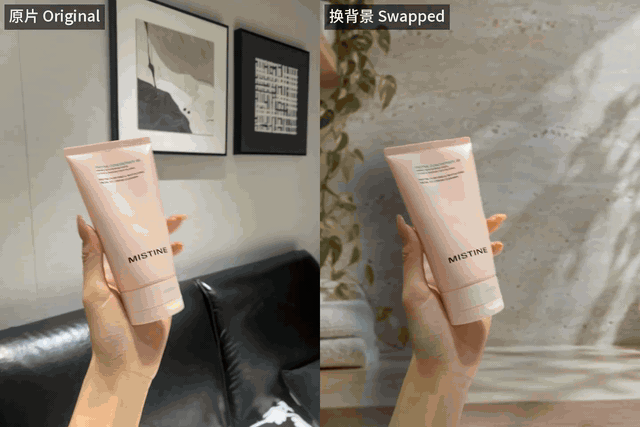

# live-swap-bg · 动图换背景

[English](README.en.md) | 中文

把一段**真实拍摄**的手持商品视频（iPhone Live Photo / 短视频）换到一个新场景里：
手和商品原样保留，背景换成你生成的场景图，并且跟着原镜头一起移动。导出 MP4，也能导出 Live Photo。



三条都是同一套默认流程跑出来的：手、指甲、包装字都是原片里的像素，背景跟着原镜头平移。静态总览见 [`demo/gallery/before-after.jpg`](demo/gallery/before-after.jpg)。

## 为什么做这个

- **不用视频生成模型。** 视频里的手和商品都是真实拍摄的，这个工具只做分割和抠图（SAM 2 + ViTMatte），
  所以商品不会变形，包装上的字也不会写错。AI 视频模型凭一张图去理解商品，常把包装画错，带货视频里的商品就和实物对不上了。
  只有背景要用生图模型，而且只生成一张静态图，见下面的[背景图怎么生成](#背景图怎么生成)。
- **本地 GPU，边际成本接近零。** 在 Apple M4 的 Mac 上，一条 2.8 秒的 Live Photo（83 帧）从头到尾 5 到 7 分钟
  （两次实测 4.6 和 6.8 分钟，随机器负载变化），除了电费不花钱。对比一下，按条计费的视频生成服务，我们之前用过的一家 4 秒 720p 一条约 2 元。
- **看起来像真的在那儿拍的。** 新背景按原片背景算出的镜头运动一起平移（商品在动、背景纹丝不动，一眼就假）；
  商品按新背景的光源重新打光，投下阴影；抠图边缘带着的原墙色会被洗掉。

这套流程是从我们自己做抖音动图带货的工作里抽出来的，前后做了几百条，文档和 Claude Code skill 里写的都是踩过的坑。

## 能做什么，不能做什么

- 输出固定为竖版 3:4，720×960，30fps。输入会居中裁成 3:4，不拉伸。
- 只还原镜头的**平移**，不还原旋转、缩放、透视和视差。手机手持的轻微晃动没问题，大幅转动镜头的片子不适合。
- **片子要挑**：原背景要有纹理（纯色墙算不出镜头运动），手要从画面边缘伸进来，手和商品不能碰到画面上沿。
  `live-swap-bg check` 可以先给片子打分。
- 抠图从首帧上的几个**提示点**开始（商品一组、手一组），这一步决定质量。我们自己是交给 AI agent 做的：
  它看带坐标网格的首帧写出提示点，再看轮廓图自己补点修正，直到轮廓贴住真实边缘，人不用动手。
  方法写在 skill 里，见[用 AI agent 来做](#用-ai-agent-来做)；没有 agent 也可以照着格式手写。
- **成片一定要人看。** 指标只能告诉你看哪几帧。我们自己做的时候，20 条里放大检查能挑出 8 条有问题，再回头修。
- 在 Apple 芯片 Mac（MPS）上实测过。NVIDIA 显卡（CUDA）代码里支持，但没有测过。
- Live Photo 导出只支持 macOS（用的是 AVFoundation），并且输入必须是 iPhone Live Photo 的原始 `.MOV`。
  工具会校验配对 ID 和静帧标记，但导入手机这一步需要你自己确认。

## 安装

需要 Python 3.10+、[ffmpeg](https://ffmpeg.org/)；导出 Live Photo 还需要 Xcode 命令行工具（`xcode-select --install`）。

```bash
git clone https://github.com/Gxz-NGU/live-swap-bg.git
cd live-swap-bg
python3 -m venv .venv && source .venv/bin/activate
pip install -e .
live-swap-bg download-models        # SAM 2.1 Large + ViTMatte，约 1.3 GB，下载到 ./models
```

## 背景图怎么生成

新背景是一张静态图，要用生图模型单独生成。我们用的是 [Codex CLI](https://github.com/openai/codex) 自带的生图功能
（用 ChatGPT 账号登录），模型参数 `gpt-5.6-terra`，一张大约 1 分钟，出图 1086×1448。本仓库演示里的四张背景都是这样生成的：

```bash
codex exec -m gpt-5.6-terra --sandbox read-only --skip-git-repo-check \
  "Generate one image. Do not write code, do not explain. $(cat demo/eucerin/background-prompt.txt)"
# 生成的图片在 ~/.codex/generated_images/ 下
```

其他生图模型我们没有试过，按下面几条写提示词应该都能用：

- **只要背景**：不要人、手、商品、文字、logo。不明说的话，模型经常把商品也画进去。
- **竖版 3:4**，画面中间留空，道具只放在边角，别挡住手和商品活动的位置。
- **明暗接近原片的墙**：差太多时 `plate` 会拒绝调色（见[流程](#流程)）。商品和背景要拉开，白瓶子别配纯白墙。
- **按商品配场景**：洁面配浴室台面，香氛配卧室窗边，同一批别重样。

提示词例子：[`demo/eucerin/background-prompt.txt`](demo/eucerin/background-prompt.txt)，以及顶部三条对比用的
[`demo/gallery/scene-prompts/`](demo/gallery/scene-prompts/)。

## 快速开始（用自带的演示素材）

```bash
live-swap-bg init demo/eucerin/IMG_1848.MOV work/eucerin
cp demo/eucerin/prompts.json work/eucerin/      # 首帧上的提示点；换成你的片子时让 agent 写，或者手写
live-swap-bg seed  work/eucerin                 # 看 work/eucerin/seed-review.jpg，轮廓要贴住真实边缘
live-swap-bg track work/eucerin                 # SAM 2 全片跟踪（M4 上 3 到 4 分钟）
live-swap-bg matte work/eucerin                 # ViTMatte 抠细边缘（M4 上 1.5 到 2 分钟）
live-swap-bg motion work/eucerin                # 从原背景估算镜头运动
live-swap-bg plate work/eucerin demo/eucerin/background.png
live-swap-bg render work/eucerin                # -> work/eucerin/out/eucerin.mp4
live-swap-bg crops work/eucerin                 # 原分辨率边缘图，自查用
live-swap-bg livephoto work/eucerin             # -> work/eucerin/out/livephoto/eucerin.JPG + .MOV
```

每一步都会打印一段 JSON，并把结果写进工作目录。目录结构见 [`live_swap_bg/clip.py`](live_swap_bg/clip.py) 顶部。

## 用 AI agent 来做

我们平时就是这么用的：人只负责给素材和最后看成片，中间每一步都由 agent 完成。以 Claude Code 为例，把 skill 拷到它能找到的地方：

```bash
cp -r skills/live-swap-bg ~/.claude/skills/
```

然后直接说"帮我把这条视频换个背景"，把视频给它（场景图可以自己给，也可以让它写提示词、调用 Codex 生成）。
skill 会带着它走完整个流程：看网格图打提示点、看轮廓图修正、每一步要检查什么、常见问题怎么修，
以及哪些问题指标看不出来、必须交给人看。这些都是我们实际踩坑后总结的，见 [`skills/live-swap-bg/SKILL.md`](skills/live-swap-bg/SKILL.md)。
skill 就是一份 Markdown 说明，不绑定 Claude Code：我们的生产批次也交给 Codex 按同样的说明做过。

## 流程

| 步骤 | 命令 | 做什么 |
|---|---|---|
| 选片 | `check` | 原背景能不能算出镜头运动 |
| 准备 | `init` | 裁成 3:4、720×960、30fps，生成带坐标网格的首帧 |
| 种子 | `seed` | 按 `prompts.json` 的框和点生成首帧掩膜 |
| 跟踪 | `track` | SAM 2 把掩膜跟到每一帧；`--multi` 把各组当成独立物体跟 |
| 抠图 | `matte` | ViTMatte 抠出软边缘；`--thin` 保住泵嘴、刷头这类细部件 |
| 稳定 | `stabilize` | 可选：掩膜投票、补 alpha 掉帧、alpha 中值，各有副作用，见 skill |
| 运动 | `motion` | 从原背景估算镜头平移；估不准时自动改成静止背景 |
| 背景板 | `plate` | 人像虚化，前景边缘一圈对齐原墙颜色；新场景和原墙亮度差太大时报错，改用 `--no-match` 只虚化 |
| 渲染 | `render` | 边缘修复、重新打光、投影，合成并编码 |
| 自查 | `crops` `jitter` `flicker` | 边缘放大图、背景抖动、单帧闪烁扫描 |
| 导出 | `livephoto` | Live Photo 图片 + 视频，去掉机型、时间、位置等元数据 |

## 测试

```bash
pip install -e ".[dev]"
pytest -q
```
测试用合成数据，不需要 GPU 和模型。

## 许可证

代码采用 [MIT](LICENSE)。用到的模型都是 Apache-2.0：[SAM 2](https://github.com/facebookresearch/sam2)、
[ViTMatte](https://huggingface.co/hustvl/vitmatte-base-distinctions-646)，由 `download-models` 从发布方下载，不随仓库分发。
快速开始用的 Eucerin 素材是作者自己拍的；顶部对比里的三条原片是商家提供的推广素材，只用来展示效果，不随仓库分发。画面里的品牌归其所有者。

