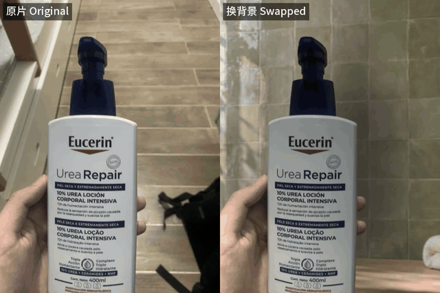

# live-swap-bg · 动图换背景

把一段**真实拍摄**的手持商品视频（iPhone Live Photo / 短视频）换到一个新场景里：
手和商品原样保留，背景换成你生成的场景图，并且跟着原镜头一起移动。导出 MP4，也能导出 Live Photo。



## 为什么做这个

- **不用视频生成模型。** 视频里的手和商品都是真实拍摄的，这个工具只做分割和抠图（SAM 2 + ViTMatte），
  所以商品不会变形，包装上的字也不会写错。AI 视频模型凭一张图去理解商品，常把包装画错，带货视频里的商品就和实物对不上了。
  只有背景图需要生图模型，用你顺手的任何工具都行。
- **本地 GPU，边际成本接近零。** 在 Apple M4 的 Mac 上，一条 2.8 秒的 Live Photo（83 帧）从头到尾大约 4.6 分钟，
  除了电费不花钱。对比一下，按条计费的视频生成服务，我们之前用过的一家 4 秒 720p 一条约 2 元。
- **看起来像真的在那儿拍的。** 新背景按原片背景算出的镜头运动一起平移（商品在动、背景纹丝不动，一眼就假）；
  商品按新背景的光源重新打光，投下阴影；抠图边缘带着的原墙色会被洗掉。

这套流程是从我们自己做抖音动图带货的工作里抽出来的，前后做了几百条，文档和 Claude Code skill 里写的都是踩过的坑。

## 能做什么，不能做什么

- 输出固定为竖版 3:4，720×960，30fps。输入会居中裁成 3:4，不拉伸。
- 只还原镜头的**平移**，不还原旋转、缩放、透视和视差。手机手持的轻微晃动没问题，大幅转动镜头的片子不适合。
- **片子要挑**：原背景要有纹理（纯色墙算不出镜头运动），手要从画面边缘伸进来，手和商品不能碰到画面上沿。
  `live-swap-bg check` 可以先给片子打分。
- 种子掩膜要**人工在首帧上点几个点**（商品一组、手一组）。这是质量的关键，skill 里有详细的打点方法。
- **成片一定要人看。** 指标只能告诉你看哪几帧。我们自己做的时候，20 条里放大检查能挑出 8 条有问题，再回头修。
- 在 Apple 芯片 Mac（MPS）上实测过。NVIDIA 显卡（CUDA）代码里支持，但没有测过。
- Live Photo 导出只支持 macOS（用的是 AVFoundation），并且输入必须是 iPhone Live Photo 的原始 `.MOV`。
  工具会校验配对 ID 和静帧标记，但导入手机这一步需要你自己确认。

## 安装

需要 Python 3.10+、[ffmpeg](https://ffmpeg.org/)；导出 Live Photo 还需要 Xcode 命令行工具（`xcode-select --install`）。

```bash
git clone https://github.com/Gxz-NGU/live-swap-bg.git
cd live-swap-bg
python3 -m venv .venv && source .venv/bin/activate
pip install -e .
live-swap-bg download-models        # SAM 2.1 Large + ViTMatte，约 1.3 GB，下载到 ./models
```

## 快速开始（用自带的演示素材）

```bash
live-swap-bg init demo/eucerin/IMG_1848.MOV work/eucerin
cp demo/eucerin/prompts.json work/eucerin/      # 首帧上的打点，正式用时要自己写
live-swap-bg seed  work/eucerin                 # 看 work/eucerin/seed-review.jpg，轮廓要贴住真实边缘
live-swap-bg track work/eucerin                 # SAM 2 全片跟踪（M4 约 2.7 分钟）
live-swap-bg matte work/eucerin                 # ViTMatte 抠细边缘（M4 约 1.4 分钟）
live-swap-bg motion work/eucerin                # 从原背景估算镜头运动
live-swap-bg plate work/eucerin demo/eucerin/background.png
live-swap-bg render work/eucerin                # -> work/eucerin/out/eucerin.mp4
live-swap-bg crops work/eucerin                 # 原分辨率边缘图，自查用
live-swap-bg livephoto work/eucerin             # -> work/eucerin/out/livephoto/eucerin.JPG + .MOV
```

每一步都会打印一段 JSON，并把结果写进工作目录。目录结构见 [`live_swap_bg/clip.py`](live_swap_bg/clip.py) 顶部。

## 用 Claude Code 来做

把 skill 拷到 Claude Code 能找到的地方：

```bash
cp -r skills/live-swap-bg ~/.claude/skills/
```

然后直接说"帮我把这条视频换个背景"，把视频和场景图给它。skill 会带着它走完整个流程：每一步要看什么、
哪些问题指标看不出来必须人眼查、常见问题怎么修。这些都是我们实际踩坑后总结的，见 [`skills/live-swap-bg/SKILL.md`](skills/live-swap-bg/SKILL.md)。

## 流程

| 步骤 | 命令 | 做什么 |
|---|---|---|
| 选片 | `check` | 原背景能不能算出镜头运动 |
| 准备 | `init` | 裁成 3:4、720×960、30fps，生成带坐标网格的首帧 |
| 种子 | `seed` | 按 `prompts.json` 的框和点生成首帧掩膜 |
| 跟踪 | `track` | SAM 2 把掩膜跟到每一帧；`--multi` 把各组当成独立物体跟 |
| 抠图 | `matte` | ViTMatte 抠出软边缘；`--thin` 保住泵嘴、刷头这类细部件 |
| 稳定 | `stabilize` | 可选：掩膜投票、补 alpha 掉帧、alpha 中值，各有副作用，见 skill |
| 运动 | `motion` | 从原背景估算镜头平移；估不准时自动改成静止背景 |
| 背景板 | `plate` | 人像虚化，前景边缘一圈对齐原墙颜色 |
| 渲染 | `render` | 边缘修复、重新打光、投影，合成并编码 |
| 自查 | `crops` `jitter` `flicker` | 边缘放大图、背景抖动、单帧闪烁扫描 |
| 导出 | `livephoto` | Live Photo 图片 + 视频，去掉机型、时间、位置等元数据 |

## 测试

```bash
pip install -e ".[dev]"
pytest -q
```
测试用合成数据，不需要 GPU 和模型。

## 许可证

代码采用 [MIT](LICENSE)。用到的模型都是 Apache-2.0：[SAM 2](https://github.com/facebookresearch/sam2)、
[ViTMatte](https://huggingface.co/hustvl/vitmatte-base-distinctions-646)，由 `download-models` 从发布方下载，不随仓库分发。
演示视频是作者自己拍的，画面里的品牌归其所有者。

---

## English

**live-swap-bg** swaps the background of a real, hand-held product clip (an iPhone Live Photo or a short video):
the hand and the product stay exactly as shot, and the new scene moves with the original camera.

- **No video generation model.** The hand and product are real footage; the tool only segments and mattes
  (SAM 2 + ViTMatte), so the product never warps and its label text never gets rewritten. Only the background image
  is generated, with whatever image tool you like.
- **Runs on your own GPU.** A 2.8 s Live Photo (83 frames) takes about 4.6 minutes end to end on an Apple M4 Mac.
- **Looks shot on location.** The new background follows the camera motion measured from the original background,
  the product is relit to the plate's light and casts a shadow, and the old wall colour is cleaned off the matte edge.

Output is 720×960 portrait at 30 fps; only camera translation is reconstructed. Tested on Apple Silicon (MPS);
CUDA is supported in code but untested. Live Photo export is macOS only and needs the original Live Photo `.MOV`.
A person still has to review every result. Install with `pip install -e .` then `live-swap-bg download-models`;
the walkthrough above uses the bundled demo clip. A Claude Code skill in `skills/live-swap-bg/` guides an agent
through every step and its known failure modes.
