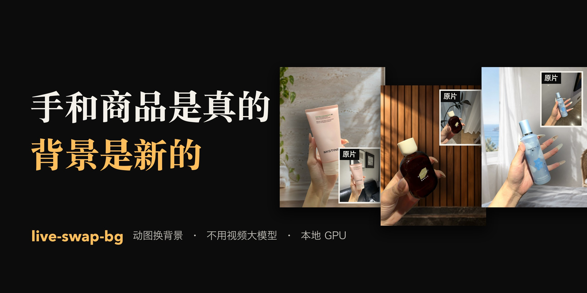
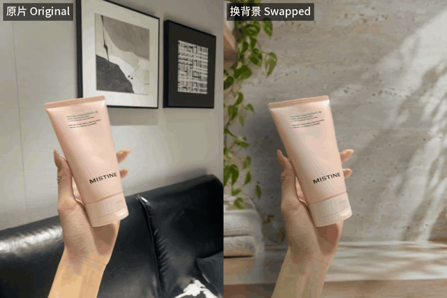
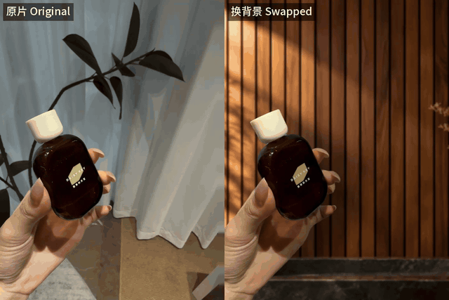
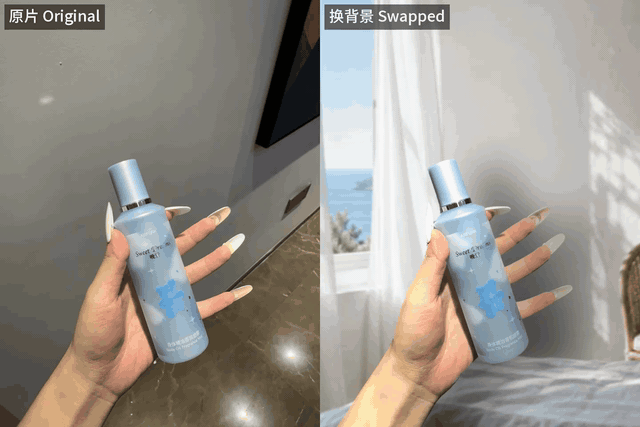
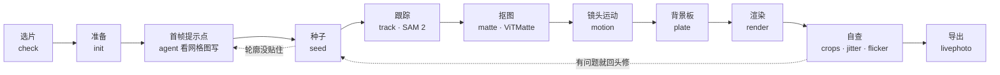

<div align="center">



# live-swap-bg · 动图换背景

**手和商品原样保留，背景换成新场景，还跟着原镜头一起动。**

[](skills/live-swap-bg/SKILL.md)
[](skills/live-swap-bg/SKILL.md)
[](pyproject.toml)
[](#许可)
[](#规格)
[](#常见问题)
[](LICENSE)

[看效果](#效果) · [为什么](#为什么) · [流程](#流程) · [背景图](#背景图怎么生成) · [安装](#安装) · [使用](#使用) · [目录结构](#目录结构) · [常见问题](#常见问题) · [English](README.en.md)

</div>

---

一段手持商品的 Live Photo 或短视频，换到**你生成的新场景**里：手、指甲、包装上的字都是原片像素，
背景跟着原镜头平移，商品按新场景的光重新打光、投下影子。导出 **MP4**，也能导出 **Live Photo**。

不用视频生成模型，整条链路在本地 GPU 上跑（SAM 2 跟踪 + ViTMatte 抠边）。这套流程是从我们自己做抖音动图带货的工作里抽出来的，
前后做了几百条，skill 里写的都是踩过的坑。

## 效果

三个例子用的是同一套命令，差别只在首帧提示点、背景图和个别参数（每条下面写了）。左边原片，右边换背景后。

### 例 01 · 洁面乳（石灰华墙 + 叶影）

手机左右晃了 100 多像素，新背景跟着原镜头一起平移。拇指和管身之间的小缝用 `render --max-gap-pixels` 补成实心，
免得它在原墙和新墙之间来回闪。



### 例 02 · 深色玻璃瓶（木格栅墙 + 暖光）

原片背景是白纱帘和绿植，换成暖色木墙。原片在第 50 帧附近丢过一帧，所以只渲染前 49 帧（`render --count 49`）；
新场景比原墙暗一截，用 `plate --no-match` 只虚化不调色。



### 例 03 · 喷雾瓶 + 透明长美甲（海边卧室）

透明长美甲是最难抠的一类，指甲里透出来的就是背后的墙。原墙是深灰，新场景很亮，同样用 `--no-match`。



三条的静态总览：[`demo/gallery/before-after.jpg`](demo/gallery/before-after.jpg)。

## 为什么

- 🎬 **不用视频生成模型。** 视频里的手和商品都是真实拍摄的，这个工具只做分割和抠图，所以商品不会变形，包装上的字也不会写错。
  AI 视频模型凭一张图去理解商品，常把包装画错，带货视频里的商品就和实物对不上了。只有背景要用生图模型，而且只生成一张静态图。
- 💻 **本地 GPU，边际成本接近零。** 在 Apple M4 的 Mac 上，一条 2.8 秒的 Live Photo（83 帧）从头到尾 5 到 7 分钟，除了电费不花钱。
  对比一下，按条计费的视频生成服务，我们之前用过的一家 4 秒 720p 一条约 2 元。
- 📷 **看起来像真的在那儿拍的。** 新背景按原片背景算出的镜头运动一起平移（商品在动、背景纹丝不动，一眼就假）；
  商品按新背景的光源重新打光，投下阴影；抠图边缘带着的原墙色会被洗掉。

## 流程



| 步骤 | 命令 | 做什么 |
|---|---|---|
| 🎯 **选片** | `check` | 原背景能不能算出镜头运动；不合格的片子后面怎么修都修不好 |
| 📐 **准备** | `init` | 居中裁成 3:4、720×960、30fps，生成带坐标网格的首帧 |
| 📍 **种子** | `seed` | 按 `prompts.json` 里的框和点生成首帧掩膜，出一张轮廓图供检查 |
| 🎞️ **跟踪** | `track` | SAM 2 把掩膜跟到每一帧；`--multi` 把各组当成独立物体跟 |
| ✂️ **抠图** | `matte` | ViTMatte 抠出软边缘；`--thin` 保住泵嘴、刷头这类细部件 |
| 🧹 **稳定** | `stabilize` | 可选：掩膜投票、补 alpha 掉帧、alpha 中值，各有副作用，见 skill |
| 🧭 **运动** | `motion` | 从原背景估算镜头平移；估不准时自动改成静止背景 |
| 🖼️ **背景板** | `plate` | 人像虚化，前景边缘一圈对齐原墙颜色；亮度差太大时报错，改用 `--no-match` 只虚化 |
| 💡 **渲染** | `render` | 边缘修复、重新打光、投影，合成并编码 MP4 |
| 🔍 **自查** | `crops` `jitter` `flicker` | 原分辨率边缘图、背景抖动、单帧闪烁扫描 |
| 📱 **导出** | `livephoto` | Live Photo 图片 + 视频，去掉机型、时间、位置等元数据 |

每一步都会打印一段 JSON，并把结果写进工作目录，目录约定见 [`live_swap_bg/clip.py`](live_swap_bg/clip.py) 顶部。

### 原则

> 手和商品只用原片像素 · 不用视频生成模型 · 背景跟着原镜头走 · 只抠手里拿着的那一个商品 · 指标只指路，成片必须人看

## 规格

| 项目 | 说明 |
|---|---|
| 输出 | 竖版 3:4，720×960，30fps；输入居中裁切，不拉伸 |
| 输入 | 手持商品的短视频，最长 150 帧（30fps 下 5 秒），更长的用 `init --start/--end` 截一段 |
| 镜头 | 只还原平移，不还原旋转、缩放、透视和视差；手持的轻微晃动没问题，大幅转动镜头的片子不适合 |
| 选片 | 原背景要有纹理（纯色墙算不出镜头运动）；手从画面边缘伸进来；手和商品不碰画面上沿 |
| 速度 | Apple M4 上一条 2.8 秒（83 帧）5 到 7 分钟（两次实测 4.6 和 6.8 分钟，随机器负载变化） |
| 硬件 | Apple 芯片 Mac（MPS）实测；NVIDIA 显卡（CUDA）代码里支持，但没有测过 |
| 导出 | MP4；Live Photo 只支持 macOS，输入必须是 iPhone Live Photo 的原始 `.MOV` |
| 人工 | 首帧提示点交给 agent，人不用动手；成片一定要人看，我们自己放大检查，20 条里能挑出 8 条有问题 |

## 背景图怎么生成

新背景是一张静态图，要用生图模型单独生成。我们用的是 [Codex CLI](https://github.com/openai/codex) 自带的生图功能
（用 ChatGPT 账号登录），模型参数 `gpt-5.6-terra`，一张大约 1 分钟，出图 1086×1448。本仓库演示里的四张背景都是这样生成的：

```bash
codex exec -m gpt-5.6-terra --sandbox read-only --skip-git-repo-check \
  "Generate one image. Do not write code, do not explain. $(cat demo/eucerin/background-prompt.txt)"
# 生成的图片在 ~/.codex/generated_images/ 下
```

其他生图模型我们没有试过，按下面几条写提示词应该都能用：

- **只要背景**：不要人、手、商品、文字、logo。不明说的话，模型经常把商品也画进去。
- **竖版 3:4**，画面中间留空，道具只放在边角，别挡住手和商品活动的位置。
- **明暗接近原片的墙**：差太多时 `plate` 会拒绝调色（见[流程](#流程)）。商品和背景要拉开，白瓶子别配纯白墙。
- **按商品配场景**：洁面配浴室台面，香氛配卧室窗边，同一批别重样。

提示词例子：[`demo/eucerin/background-prompt.txt`](demo/eucerin/background-prompt.txt)，以及上面三个例子用的
[`demo/gallery/scene-prompts/`](demo/gallery/scene-prompts/)。

## 安装

**需要**：Python 3.10+、[ffmpeg](https://ffmpeg.org/)；导出 Live Photo 还需要 Xcode 命令行工具（`xcode-select --install`）。

```bash
git clone https://github.com/Gxz-NGU/live-swap-bg.git
cd live-swap-bg
python3 -m venv .venv && source .venv/bin/activate
pip install -e .
live-swap-bg download-models        # SAM 2.1 Large + ViTMatte，约 1.3 GB，下载到 ./models
```

再把 skill 装给你的 agent：

**Claude Code**

```bash
cp -r skills/live-swap-bg ~/.claude/skills/
```

**Codex**

```bash
cp -r skills/live-swap-bg ~/.codex/skills/
```

装好后新开一个对话。agent 要能找到 `live-swap-bg` 命令和模型：在激活了 `.venv` 的终端里启动它；
不在仓库目录下用时，设 `LIVE_SWAP_BG_MODELS=<仓库路径>/models`（默认找当前目录下的 `./models`）。

## 使用

在 Claude Code 或 Codex 里直接说：

> 用 live-swap-bg 把 ~/Desktop/IMG_2034.MOV 换个背景，商品是一支粉色洁面乳，场景要明亮的浴室台面，做完给我看前后对比和边缘放大图。

agent 会照 skill 走完：检查片子 → 看网格图写首帧提示点，对着轮廓图修到贴边 → 跟踪、抠图 → 写背景提示词并生成 → 渲染 →
自查边缘和背景抖动，最后把成片交给你看。我们平时就是这么用的，人只负责给素材和看成片。
skill 就是一份 Markdown 说明，不绑定 Claude Code：我们的生产批次也交给 Codex 按同样的说明做过。

想自己动手，用自带的演示素材跑一遍：

```bash
live-swap-bg init demo/eucerin/IMG_1848.MOV work/eucerin
cp demo/eucerin/prompts.json work/eucerin/      # 首帧上的提示点；换成你的片子时让 agent 写，或者手写
live-swap-bg seed  work/eucerin                 # 看 work/eucerin/seed-review.jpg，轮廓要贴住真实边缘
live-swap-bg track work/eucerin                 # SAM 2 全片跟踪（M4 上 3 到 4 分钟）
live-swap-bg matte work/eucerin                 # ViTMatte 抠细边缘（M4 上 1.5 到 2 分钟）
live-swap-bg motion work/eucerin                # 从原背景估算镜头运动
live-swap-bg plate work/eucerin demo/eucerin/background.png
live-swap-bg render work/eucerin                # -> work/eucerin/out/eucerin.mp4
live-swap-bg crops work/eucerin                 # 原分辨率边缘图，自查用
live-swap-bg livephoto work/eucerin             # -> work/eucerin/out/livephoto/eucerin.JPG + .MOV
```

## 目录结构

```
live-swap-bg/
├── live_swap_bg/            命令行工具 live-swap-bg
│   ├── cli.py               所有子命令的入口
│   ├── clip.py              工作目录约定
│   ├── prepare.py           init：裁切、抽帧、带网格的首帧
│   ├── seed.py              seed：按提示点生成首帧掩膜和轮廓图
│   ├── track.py             track：SAM 2 全片跟踪
│   ├── matte.py             matte：ViTMatte 软边缘
│   ├── stabilize.py         stabilize：时间稳定
│   ├── motion.py            motion：从原背景估镜头平移
│   ├── plate.py             plate：背景板虚化、边缘对齐原墙色
│   ├── render.py            render：合成、编码
│   ├── edges.py  light.py   边缘修复；重新打光和投影
│   ├── livephoto.py         livephoto，调用 swift/LivePhotoPair.swift
│   ├── qa.py                check / crops / jitter / flicker
│   └── models.py  device.py download-models；选 GPU
├── skills/live-swap-bg/
│   └── SKILL.md             给 agent 读的操作说明：打点方法、每步检查什么、常见问题
├── demo/
│   ├── eucerin/             快速开始的演示素材（作者自拍）：原片、提示点、背景图和提示词
│   └── gallery/             上面三个例子的 GIF、静态总览、场景提示词
├── assets/banner.jpg        README 头图
├── tests/                   单测（合成数据，不需要 GPU 和模型）
├── README.md  README.en.md
├── pyproject.toml
└── LICENSE
```

三个例子的原片没有放进仓库，只有对比 GIF 和场景提示词。跑测试：`pip install -e ".[dev]" && pytest -q`。

## 常见问题

<details>
<summary><b>没有 Mac 能用吗？</b></summary>

NVIDIA 显卡（CUDA）在代码里支持，但我们没测过。没有 GPU 可以加 `--device cpu`，会非常慢，也没测过。
Live Photo 导出用的是 AVFoundation，只能在 macOS 上用。
</details>

<details>
<summary><b>重新打光会不会改掉商品的颜色？</b></summary>

基本不会。打光只调亮度和明暗面，冷暖色偏被硬限制在 ΔE 2 以内（人眼刚能察觉的差别以下），见 [`live_swap_bg/light.py`](live_swap_bg/light.py)。
包装上的字和图案都是原片像素。
</details>

<details>
<summary><b>新背景在抖怎么办？</b></summary>

跑 `live-swap-bg jitter`，`high_frequency_std_px` 超过 0.5 说明背景在抖。原墙纹理太少时，镜头估计会跟着噪点跑，
用 `motion --static` 让背景静止。手机本身在晃的片子，背景跟着晃才是对的。
</details>

<details>
<summary><b>边缘有一圈白边或黑边？</b></summary>

`render` 默认会洗掉抠图边缘带着的原墙色。还有残留就看 `out/edge-crops.jpg`，常见原因和修法在
[skill 的问题表](skills/live-swap-bg/SKILL.md)里。
</details>

<details>
<summary><b>为什么一定要人看成片？</b></summary>

有一类问题指标看不出来，比如指缝在原墙和新墙之间一帧一跳、透明长甲像不像。我们自己做的时候，20 条里放大检查能挑出 8 条有问题。
</details>

<details>
<summary><b>导出的 Live Photo 手机认不出来？</b></summary>

输入必须是 iPhone Live Photo 的原始 `.MOV`，它的元数据轨道是照片 App 认 Live Photo 的依据。工具会校验配对 ID 和静帧标记，
但导入手机这一步还没有实测过，导入后请长按确认。
</details>

## 反馈

遇到问题或有想法，直接[提 issue](https://github.com/Gxz-NGU/live-swap-bg/issues/new)，附上出问题那几帧的 `out/edge-crops.jpg` 或 `out/review-*.jpg`。

## 许可

代码采用 [MIT](LICENSE)。用到的模型都是 Apache-2.0：[SAM 2](https://github.com/facebookresearch/sam2)、
[ViTMatte](https://huggingface.co/hustvl/vitmatte-base-distinctions-646)，由 `download-models` 从发布方下载，不随仓库分发。
快速开始用的 Eucerin 素材是作者自己拍的；三个例子的原片是商家提供的推广素材，只用来展示效果，不随仓库分发。画面里的品牌归其所有者。
